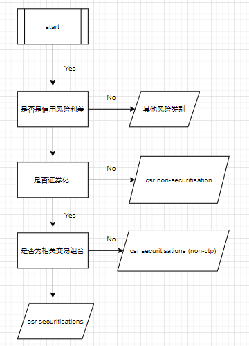
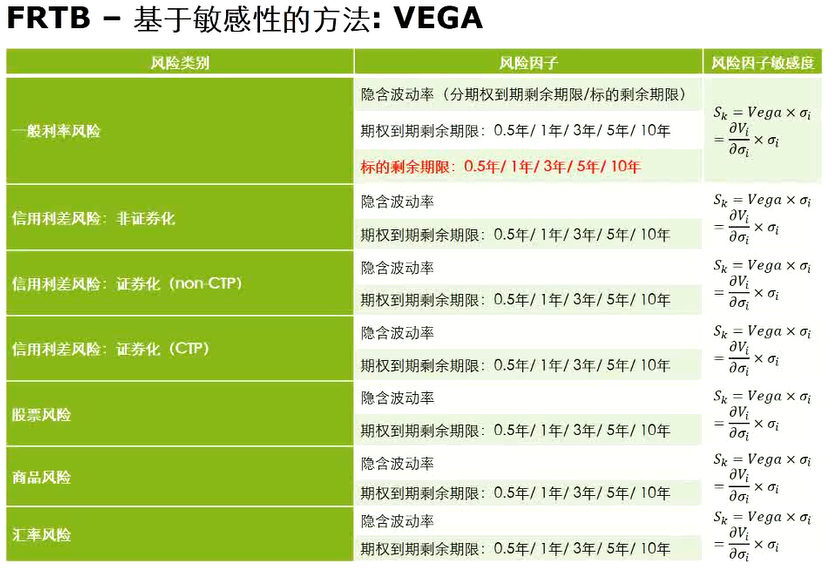
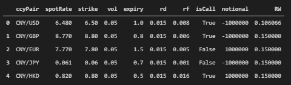
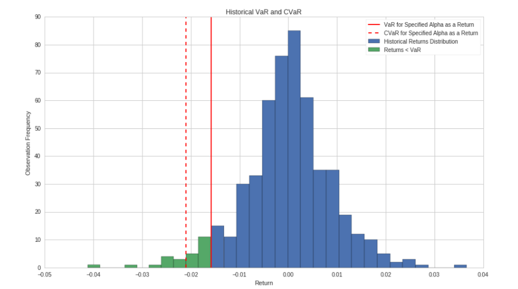

<!-- 

可使用下述程式碼把markdown格式轉成word
```
pandoc -o output.docx -f markdown -t docx input.md
```
 -->

Fundamental Review of the traning book , 简称为 `FRTB`

一种规范基于实践上考虑,非考虑实验环境

计量会牵涉到 `risk factor`

银行定义的风险与b银行定义的风险实施不一样

衡量风险管理以及资本充足

评估市场风险以及资本金,衡量两者之间的平衡

考虑风险存钱以及考虑把钱移出去赚更多的钱之间计算一个金额

巴塞尔资本协定

为什么需要frtb , 在美国金融风暴后, 认识到后尾是不可以忽略的 

VaR 是使用过去的历史数据计算的 , 不满足struc VaR? , 于是产生 struc VaR 的

后尾考虑不周 所以对于计算出来的VaR不够结构化 监管烦恼的一点

(猜的)对于不同的 portfolio 计算出来的VaR 都不同

大型银行都做 Struc VaR 

# FRTB 市场风险监管框架

- 账簿划分

    - 交易账簿/银行账簿划分 `trading book / banking book`

    - 修订内部风险转移(IRTs)规则

    - 禁止通过转换账簿进行监管套利

目的导向 >> 交易为目的)(以自营为目的) 在交易账簿里

根据巴塞尔协议规定...

三大原则

- 内模法调整

    - ES取代VaR

    - DRC取代IRC

    - 在交易台层面计提资本

    - 限制对冲及分散化效益带来的资本减少

    - 用PLA test审批交易台

- 标准法调整 

    - 新标准法 = 敏感度 + 违约风险计量 + 剩余风险计量

    - 提出简化标准法

    - 在交易台层面计提资本

    - 作为内模法的底线与后盾 , Remark : 所以标准法是基本的 , 无论是否需要内模法标准法是一定要的 

- 流动性期限调整 (标准法与内模法流动性期限调整不一样其他适用于流动性调整)

    - 将流动性期限划为5档 : 10 , 20 , 40 , 60 , 100个工作日

    - 五大类风险划为26个风险小组

    - 定期更新各风险小组的流动性期限

- 报告披露要求

    - 更详细的报告

    - 频率更高的报告

    - 试算分析报告

Remark : 除了内模法银行可做可不做 , 剩余是一定要做的

# 账簿划分

$\ldots$

# FRTB 标准法 一般步骤

<p style="text-align:center;">银行有什么产品?例如产品清单</p>

$$\downarrow$$

<p style="text-align:center;">根据金融产品类别区分</p>

```
- 产品的资产类别是 ? 

- 产品是线性还是非线性 ? 

    - 线性 : delta , 只需求 delta 

    - 非线性产品 : delta , vega and curvature , 三个都要求

- 是否应用RRAO ? 如无预付风险 , 相关性风险和期差风险
```

$$\downarrow$$

<p style="text-align:center;">风险敏感性的计算与生成</p>

```
- 从定价模型中采集敏感性

- 使用标准模型相关性和汇总公式对敏感性进行汇总,再加入违约风险和剩余费用
```

$$\downarrow$$

<p style="text-align:center;">违约风险和剩余风险加入</p>

```
- DRC : 信用和股票头寸的违约风险

- RRAO : SBM 和 DRC 不能捕捉到风险的产品
```

Remark : 这就算监管机构完整的计量

# FRTB 标准法


- 以敏感性为核心的方法]

- 强制性 : 即使在内模法获得监管批准的情况下标准法的使用也是必需

- 以交易台层面来批准和应用标准法/内模法

- 标准化 : 在每个资产类别下 , delta / vega 资本费用通过每个风险类别内风险因素的权重和加总进行 delta / vega 定义

- 一致性和可比较性 : 不同国家 , 不同银行采用统一的标准法计量和公布标准法下风险资本的模式

Remark : 简化标准法适用小型的银行机构 

Remark : 标准法在监管机构下越来越标准也越来越复杂

$$K_{sa}=SBM + RRAO + DRC$$

Remark : 这三者之间没办法做抵消的行为 , 因为是线性相加,是算式相加

每个风险因子都是独立(孤立) , 例如里面的 delta 与 vega 之间不能互相抵消

孤立可看作是没有计算风险因子间的风险对冲和多元化效益(no diversification benefits)

Remark : 标准法可以捕获证券化风险头寸

## risk class 

监管机构根据资产7大类来区分做相对应的资本计量 :

1. general interest rate risk (GIRR) , 一般利率风险

2. credit spread risk (CSR) : non-securitisations , 信用价差风险 : 非证券化

3. CSR : securitisations (non-correlation trading portfolio , or non-CTP) , 信用价差风险 : 证券化(非关联交易组合)

4. CSR : securitisations (correlation trading portfolio , or CTP) , 信用价差风险 : 证券化(关联交易组合)

5. equity risk , 股票风险

6. commodity risk , 商品风险

7. foreign exchange (FX) risk , 汇率风险

## risk weight 

调整风险计量里面的相互影响

- 一般利率风险(GIRR)的RW : 静态的 , 由巴塞尔委员会定义 

- 外汇风险的RW : 等于所有FX敏感度30%

## risk factor

影响金融工具估计的变量 , 如股票价格 , 利率期限点等 

## risk bucket

不同的风险底下有不同的bucket

单个风险类别内具有共同特征的一组风险因子 , 如同一货币利率曲线上所有期限点

币种不同就算不同`risk bucket` 

## risk position 风险头寸

敏感度方法下 , delta , vega 风险头寸指风险因子的Delta , vega 敏感度 , curvature risk position 指向上冲击和向下冲击的压力情景下最大的曲率敏感度 

<!-- ## risk capital requirement -->

## risk charge 风险费用

商业银行因承担市场风险而需计提资本

## $\rho_{kl}$ 和 $\gamma_{kl}$ 的相关性 

风险组别之间的相关性 , 风险类别之间的相关性

每个相关性有三个场景 

- 1.25x

- 1.00x

- 0.75x 

其中投资组合的风险费用选用最大

Remark : 针对 curvature $\gamma$ 的计算 , 对于非1.00x的场景, 需要使用1.00x的$\gamma$的相关系数进行平方后才调用场景

## correlation trading portfolio CTP 关联交易组合

- 符合下述特征的证券化头寸 (资产证券化)

    - 即不是再证券化头寸 , 也不是不按比例获得分层级收益的证券化衍生工具 

    - 所有参考实体都是单名产品 , 包括具有双向流动市场的单名信用衍生工具 , 包括这些参考实体的交易指数

    - 工具的参考实体不涉及以下基础资产 : 信用风险标准法下零售敞口, 住房抵押贷款敞口 , 商业房地产抵押贷款敞口

    - 该工具不与特殊目的的实体的权益挂钩

    - 对上述头寸进行非证券化对冲的工具

Remark : 还是不懂 ...

# 敏感度方法计量 SBM sensitivity based method
 
Remark : 敏感性指的是 delta , vage , curvature 

线性风险 : delta

delta : 交易价格与相关标的资产(Underlying Asset)价格的1个货币单位变化之间的变化率

非线性风险 : vega , curvature

vega : 期权组合的价值与标的资产的波动率之间的变化率 , 也指出隐含波动率的1个货币单位变化引起的期权价格变化

curvature : 期权价值中没有被delta风险捕获到增量风险 , 曲率风险的计量是基于两个压力情景(上调和下调风险因子)中比较糟糕的情况 (类似gamma概念,2阶导数)

SBM占整个计量80%

下列是他们的计算方式与定义 :

## GIRR general interest rate risk 一般利率风险

对应的风险因子是无风险收益率曲线特定期限上的利率

敏感性指标为金融工具i关于无风险收益率曲线特定期限点t的PV01 , 实际计算时通过变动无风险收益率曲线该特定期限点t利率1BP进而测算该笔金融工具估值的变化再除于1BP的到 : 

$$S_{k,r_t}=\frac{V_i(r_t+0.001 , cs_t)-V_i(r_t,cs_t)}{1bp}$$

其中:

$1bp$

> $0.0001 = 0.01\%$

$r_t$

> 无风险收益率曲线上期限点t对应的无风险利率V

$cs_t$

> 信用价差曲线上期限点t对应的信用价差

$V_i$

> 金融工具的市值 , 其为无风险利率曲线和信用价差曲线的函数

期限点为 0.25年 , 0.5年 , 1年 , 2年 , 3年 , 5年 , 10年 , 15年 , 20年 , 30年

**案例 :**  

1. 假设只存在一张剩余2.3年的债券 :

```
0.25 变动 1bp 后重新定价求取净敏感度后放到 0.25年 Sk 乘于对应的risk weight 获得加权敏感度再对0.5年做与0.25年一样的事情直到做到3年
```

2. 假设3个金融工具分为 2.3年债券A , 3年债券B , 11年债券C , 皆在同一条定价曲线上(只用一条无风险利率曲线做定价使用) :

```
A >> 0.25年变动 1bp 后重新定价求取净敏感度后放到 0.25年 Sk , 再对0.5年做与0.25年一样的事情直到3年

B >> 0.25年变动 1bp 后重新定价求取净敏感度后放到 0.25年 Sk, 再对0.5年做与0.25年一样的事情直到3年

C >> 0.25年变动 1bp 后重新定价求取净敏感度后放到 0.25年 Sk , 再对0.5年做与0.25年一样的事情直到15年

把净敏感度加总再乘于对应的risk weight 获得加权敏感度
```

0.25 | 0.5 | 1 | 2 | 3 | 5 | 10 | 15
:-----:|:---:|:--:|:-:|:--:| :--: | :--: | :--:
A+B+C | A+B+C | A+B+C | A+B+C | A+B+C | C | C | C

再乘于对应的风险权重 

<!-- 3. 假设3个金融工具分为 2.3年债券A , 3年债券B , 10年债券C , A与B使用曲线I , C则使用曲线II , 两者皆于同一个风险组别 risk bucket : 

$$\ldots$$ -->
<!-- ```
A >> 0.25年变动 1bp 后重新定价求取净敏感度后放到 0.25年 Sk , 再对0.5年做与0.25年一样的事情直到3年

B >> 0.25年变动 1bp 后重新定价求取净敏感度后放到 0.25年 Sk, 再对0.5年做与0.25年一样的事情直到3年

C >> 0.25年变动 1bp 后重新定价求取净敏感度后放到 0.25年 Sk , 再对0.5年做与0.25年一样的事情直到15年

把净敏感度加总再乘于对应的risk weight 获得加权敏感度
```

0.25 | 0.5 | 1 | 2 | 3 | 5 | 10 | 15
:-----:|:---:|:--:|:-:|:--:| :--: | :--: | :--:
A+B+C | A+B+C | A+B+C | A+B+C | A+B+C | C | C | C -->


## 汇率风险

对应的风险因子是外汇即期汇率

$$S_k=\frac{V_i(1.01FX_k)-V_i(FX_k)}{0.01}$$

其中 : 

$K$

> 给定的货币

$FX_k$

> 货币与报告货币之间的汇率

$V_i$

> 为金融工具的市价,其为汇率k的函数

外汇风险的delta敏感性指标可分为两种情况 :

- 若金融工具为非期权类产品,例如外汇远期,商品风险delta敏感性指标等于外汇敞口

- 若金融工具为期权类产品,例如外汇期权,外汇风险delta的敏感性指标可以与该笔期权的delta进行相互转化

Remark : 如果是 EUR / USD , 除了计算 EUR与USD之间的敏感性还要计算 人民币与USD的敏感性和人民币与EUR的敏感性 , 因为人民币是报价货币 

Remark : 没有期限点的概念 , 只有货币的概念

Remark : 没有$\rho_{kl}$ 只有 $\gamma_{bc}$

## 股票风险

对应的风险因子是股票即期价格和股票回购利率

1. 股票即期价格

$$S_{k,cs_t}=\frac{V_i(1.01EQ_k)-V_i(EQ_k)}{0.01}$$

其中 : 

$k$ 

> 给定的股票

$EQ_k$

> 股票对应的市值

$V_i$

> 金融工具的市值 , 其为股票价格函数

2. 股票回购利率

$$S_k=\frac{V_i(RTS_k+0.0001)-V_i(RTS_k)}{0.0001}$$

其中: 

$k$

> 给定的股票

$RTS_k$

> 股票对应市值

$V_i$

> 金融工具的市值 , 其为股票对应的回购期限结构函数

## 股票风险的风险权重

风险组序号 | 股权即期价格风险权重 | 股权回购利率风险权重 | 
:--------:| :-------: | :-------:
1 | 55% | 0.55% , 股权即期价格风险权重除于100
2 | 60% | 股权即期价格风险权重除于100
3 | 45% | 股权即期价格风险权重除于100
4 | 55% | 股权即期价格风险权重除于100
5| 30% | 股权即期价格风险权重除于100
6| 35% | 股权即期价格风险权重除于100
7| 40% | 股权即期价格风险权重除于100
8| 50% | 股权即期价格风险权重除于100
9| 70% | 股权即期价格风险权重除于100
10| 50% | 股权即期价格风险权重除于100
11| 70% | 股权即期价格风险权重除于100
12| 15% | 股权即期价格风险权重除于100
13| 25% | 股权即期价格风险权重除于100

## 股票风险$\rho_{kl}$

要从三个维度划分 :

- 总市价

- 经济体类别

- 行业类别

参考 `MAR21.78`

## 商品风险

对应的风险因子是商品即期价格

$$S_k=\frac{V_i(1.01CTY_k)-V_i(CTY_k)}{0.01}$$

其中:

$k$

> 给定的商品

$CTY_k$

> 商品k对应市价

$V_i$

> 金融工具的市值,其为商品k的即期价格函数

商品风险的delta敏感性指标可分为两种情况 :

- 若金融工具为非期权类产品,例如贵金属远期,商品风险delta敏感性指标等于商品敞口

- 若金融工具为期权类产品,例如贵金属期权,商品风险delta的敏感性指标可以与该笔期权的delta(greeks)

Remark : 与股票风险类似前者调整商品价格后者调整股票价格

> 底层产品的价格

## 商品风险的风险权重

风险组序号 | 商品风险组 | 风险权重 | 
:--------:| :-------: | :-------:
1 | 能源-固体燃料 | 30%
2 | 能源-液体燃料 | 35%
3 | 能源-电力和碳交易 | 60%
4 | 货运 | 80%
5| 金属-非贵金属 | 40%
6| 气体燃料 | 45%
7| 贵金属(含黄金) | 20%
8| 谷物和油料 | 35%
9| 家畜和乳制品 | 25%
10| 软饮料和其他农产品 | 35%
11| 其他商品 | 50%

## 商品风险的$\rho_{kl}$

$$\rho_{kl}= \rho^{cty}_{kl} * \rho^{tenor}_{kl} * \rho^{basis}_{kl}$$

$\rho^{cty}_{kl}$

> 对应的基础商品是否一样 , `1` 否则看 `below table`

$\rho^{tenor}_{kl}$

> 交割期限是否相同 , `1` 否则 `0.99`

$\rho^{basis}_{kl}$

> 商品交割地点是否一致 , `1` 否则 `0.999`

风险组序号 | 商品风险组 | 相关系数 | 
:--------:| :-------: | :-------:
1 | 能源-固体燃料 | 55%
2 | 能源-液体燃料 | 95%
3 | 能源-电力和碳交易 | 40%
4 | 货运 | 80%
5| 金属-非贵金属 | 60%
6| 气体燃料 | 65%
7| 贵金属(含黄金) | 55%
8| 谷物和油料 | 45%
9| 家畜和乳制品 | 15%
10| 软饮料和其他农产品 | 40%
11| 其他商品 | 15%

## 商品风险的$\gamma_{bc}$

- 第1~10个 `risk bucket` = 20%

- 第11对其他 `risk bucket` = 0%

## 信用价差风险

对应的风险因子是信用利差曲线特定利率期限上的利率 , 信用利差风险 delta 的敏感性指标为金融工具i关于无风险收益率曲线特定期限点t的CS01

Remark : 如果利率曲线计算girr有考虑信用风险时,csr也要一起计算

$$S_{k,cs_t}=\frac{V_i(r_t , cs_t)-V_i(r_t,cs_t+0.0001)}{1bp}$$

其中:

$1bp$

> $0.0001 = 0.01\%$

$r_t$

> 无风险收益率曲线上期限点t对应的无风险利率V

$cs_t$

> 信用价差曲线上期限点t对应的信用价差

$V_i$

> 金融工具的市值 , 其为无风险利率曲线和信用价差曲线的函数

期限点为 0.5年 , 1年 , 3年 , 5年 , 10年 

FRTB框架下信用风险细分三类(前面也有提到) :

- 非证券化

- 证券化 非CTP

- 证券化 CTP

参考 `frtb案例-geo.xlsx`

判断流程 : 



## 基于敏感性的方法-delta的资本费用计量方式

Remark : risk class 的不同风险权重与 $\gamma_{bs}$ 也不同

<p style="text-align:center;">基于以上7大类资产计算在风险的净敏感性</p>

$$\downarrow$$

<p style="text-align:center;">加权敏感性 : 净敏感性与对应的风险权重的乘积</p>

$$\downarrow$$

<p style="text-align:center;">风险分档层面 Bucket level (在风险组别内加总)</p>

```
将风险加权后的敏感性与bucket层面各风险因子之间相关性加总
```

$$K_b=\sqrt{\sum_kWS^2_k+\sum_k\sum_{k\to l}\rho_{kl}WS_kWS_l}$$

其中 : 

$K_b$

> 分档层面 或者 delta头寸 (或者vega头寸)

$WS_k$ , $WS_l$

> 加权后的敏感性

$\rho_{kl}$

> 对应的不同风险因子加权敏感度的相关系数 (根据规则获得)

Remark : 平方根数值要满足大于零或者等于零

$$\downarrow$$

<p style="text-align:center;">风险分类层面 risk class level</p>

```
考虑不同风险组别 bucket 之间的相关性进行加总
```

$$\delta=\sqrt{\sum_bK_b^2+\sum_b\sum_{c\neq b}\gamma_{bc}S_bS_c}$$

其中: 

$k_b$

> 考虑同一个风险组别里的加总

$S_c$

> 对于风险组别c所有的风险因子 $\sum_k WS_k$ 

$S_b$

> 对于风险组别b所有的风险因子 $\sum_k WS_k$ 

$\gamma_{bs}$

> 跨风险组别相关系数

## 对于同一个风险组别的计算方式

对于风险组别c所有的风险因子 

$$S_c=\sum_k WS_k$$

如果上述 MAR21.4(5)(a) 内 $S_b$ 与 $S_c$ 的值使得 

$$\sum_bK_b^2+\sum_b\sum_{c\neq b}\gamma_{bc}S_bS_c < 0$$

银行需采用另一种特殊方法计算 : 

- 对于同一个风险组别b内所有的风险因子 

$$S_b=max\{min(\sum_k WS_k,K_b),-K_b\}$$

- 对于同一个风险组别c内所有的风险因子 

$$S_c=max\{min(\sum_k WS_k,K_c),-K_c\}$$

## 基于敏感性的方法-vega的资本费用计量方式

$vega$ 可认为估值函数v对于标的资产价格的波动率的一阶偏导数

$$v = \frac{\partial V}{\partial\sigma}=\lim_{h_k\to0}\frac{V(\sigma+h_k)-V(\sigma)}{h_k}$$

期权类产品的vega敏感度v可以定义为期权产品估值函数v对于标的资产价格波动率的一阶偏导数,衡量标的资产价格波动率的变化带来的期权估值的变化

FRTB框架下的$vega$ 

在FRTB计量框架下,针对给定风险类型,vega风险敏感性指标为希腊字母vega和对应期权隐含波动率的乘积 

$$S_k=vega * \sigma_i = \frac{\partial V_i}{\partial \sigma_i} * \sigma_i$$

其中:

$vega$

> 上式 $v$ 

$\sigma_i$ 

> 隐含波动率

Remark : i 是金融工具i , k 是 risk bucket

- 风险组别 `risk bucket` 与 delta 中 `risk bucket` 定义一样

- 流动性期限 liquidity horizon 

体现不同风险分类的非流动性与对冲难度的差异

流动性越高,流动期限越短 

| risk class | $LH_{risk\ class}$
| -- | -- |
| GIRR | 60 | 
| CSR non-securitisations | 60 |
| CSR securitisations (CTP) | 120 |
| CSR securitisations (non-CTP) | 120 |
| Equity (large cap) | 20 |
| Equity (small cap) | 60 | 
| commodity | 120 | 
| FX | 40 |
||

- 风险权重 (对于某个vega风险因子k)

$$RW_k=min\bigg\{RW_\sigma*\frac{\sqrt{LH_{risk\ class}}}{\sqrt{10}},100\%\bigg\}$$

其中: 

$RW_\sigma$

> 0.55

- $\rho_{kl}$ : bucket 内相关性

    -  GIRR : $\rho=min(\rho_{kl}\ option\ maturity * \rho_{kl}\ underlying\ maturity , 1)$

    - 非 GIRR : $\rho=min(\rho_{kl}\ option\ maturity * \rho_{kl}\ delta , 1)$

其中: 

$\rho_{kl}\ option\ maturity$

> $exp(-\alpha\frac{|T_k-T_j|}{min(T_k,T_j)})$

$\rho_{kl}\ underlying\ maturity$

> $exp(-\alpha\frac{|T_k^U-T_j^U|}{min(T_k^U,T^U_j)})$

$\rho_{kl}\ delta$

> delta 风险因子与 vega的风险因子之间的相关性

Remark ：这边有点争议 , 何总认为不应该需要从delta再分割vega的标准期限会造成基本计提过大

- $\gamma_{bc}$

> 在同一个资产大类(asset class)内部 , 不同buckets之间 , vega的$\gamma_{bc}$与 delta 一样 , 例如在GIRR的不同bucket之间 , $\gamma_{bc} = 0.5$



Remark : 小于0.5年直接算0.5年 , 0.5~1 , 1~3 年才做 linear interpolation , 标准线性插值

根据时间做权重 , 如果是0.75年,0.5年与1年各占50%

### 案例

计算外汇期权的vega , 使用`Garman-Kohlhgen`模型

$$C = S * N(d_1)e^{-RT}-E*N(d_2)e^{-rT}$$

$$d_1=\frac{ln(\frac{S}{E})+(r-R+\frac{\sigma^2}{2})T}{\sigma * \sqrt{T}}$$

$$d_2=d_1-\sigma * sqrt(T)$$

其中: 

$r$ 

> 报价货币利率 , 本国无风险利率

$R$

> 被报价货币利率 , 外国无风险利率 

$C$

> 欧式买权价格

$S$

> 现在即期汇率

$E$

> 外国期权协定汇率

$T$

> 距到期日的时间

获得敏感度后通过上述提出的风险权重进行加权敏感度计算 , 流程于delta计算一致 , 差别在于值和矩阵的维度不同


<!-- 2. 计算$S_k$ 使用 $vega * \sigma_i$

计算出来的$S_k$ 如果剩余年限不在标准点上,需用线性插值方法解决,以年化时间做为 $x$ 轴, $y$ 轴为 $S_k$

3. 计算 risk weight (对于某个vega风险因子k)

$$RW_k=min\bigg\{RW_\sigma*\frac{\sqrt{LH_{risk\ class}}}{\sqrt{10}},100\%\bigg\}$$

其中:

$RW_\sigma$

> 0.55

参考 $LH_{risk\ class}$使用FX risk class 计算得出 $RW_k$ = 1

4. 计算$\rho_{kl}$(delta) 和 $\rho$(option maturity)

得出三年对0.5年的相关系数 $86.1\% *99.9\%$

$\rho$ 按照公式为 $2.63%$

- $rho_{kl}^{option\ maturity}$ 等同于 $e^{-\alpha *\frac{|T_k - T_l|}{min\{ T_k - T_l\}}}$ 

其中:

$alpha$

> set at 1%

$T_k(T_l)$ 

> the maturity of the option from which the vega sensitivity $VR_k(VR_l)$ is derived , expressed as a number of years 

5. 因为是外汇期权 , 所以考虑 non-GIRR $\rho$

$$non-GIRR : \rho = min(\rho_{kl}\ option\ maturity * \rho_{delta},1) = 2.26\%$$

6. 最后计算vega矩阵

Vega(3days) : 0.029853083

Vega(3year) : 0.874697254

| Vega Portfolio | Vega(3days) | Vega(3year)
| -------------- | ----------- | -----------
| Vega(3days)    | $0.000891207=0.029853083^2$ | $0.000589636$
| Vega(3year)    | $0.000589636=0.029853083*0.874697254*2.63\%$ | $0.765095287$

Remark : 对应到标准的期限上 , 并不是求取按照实际的时间(年化)的做相关性矩阵 , 

拆分期权风险到 $s$ , $r_d$ , $r_f$ 通过计算 $vega$ 测算对S0的风险,通过对$delta(r_d,r_f)$ 计算 $r_d$ , $r_f$ 风险

1. 通过 Garman-kohlhgan model , 计算 $\rho_{rd} \, call$ , $\rho_{rf} \, call$

2. 找到对应时间的标准期限 , 累加 $\rho_{r_d}$ , $\rho_{r_f}$

3. 找到 $\rho_{bc} = 0.5$

4. $\rho_{bc}$ 设置 GIRR Delta metrics

| GIRR-Delta(Portfolio) | GIRR-Delta(Rf) | GIRR-Delta(Rd)
| --------------------- | -------------- | -------------
| GIRR-Delta(Rf) | 0.142676233 |	0.076748484 |
| GIRR-Delta(Rd) | 0.076748484 |	0.165138362 |

累积 GIRR Delta 总和 0.679199207

5.	计算头寸option Delta, 交易所数据提供 Delta Call,直接累加得出Delta

```
Delta Call(3days) 0.35681882

Delta Call(3year) 0.05329403

Total: 0.41011285
``` -->

## 基于敏感性的方法-curvature的资本费用计量方式

**以 steven li 讲师的案例解析 `curvature` 计算**



Remark : 这例子为简约版的 , 需要知道金融工具$i$只有一个

**先计算 $CVR_k^+$ , $CVR_k^-$**

已知 $CVR_k^+$ , $CVR_k^-$ 如下 : 

$$CVR_k^+=-\sum_i\{V_i(x_k^{RW(curvature)+})-V_i(x_k)-RW_k^{curvature}*S_k\}$$

$$CVR_k^-=-\sum_i\{V_i(x_k^{RW(curvature)-})-V_i(x_k)+RW_k^{curvature}*S_k\}$$

其中:

$V_i(x_k^{RW(curvature)+})$

> 期权的即期汇率变动 * (1+risk weight) 后其他条件不变下其期权价格

$V_i(x_k^{RW(curvature)-})$

> 期权的即期汇率变动 * (1-risk weight) 后其他条件不变下其期权价格

$V_i(x_k)$

> 期权价格

$S_k$

> 依据外汇风险的敏感度计算公式

$RW_k^{curvature}$

> 对于的`risk weight`

**求取 $K_b$ 值**

$$K_b=max(K_b^+,K_b^-)$$

因为此例子只有1个风险因子$k$ 所以没有利用到 $K_b+$ , $K_b-$的计算公式

单个风险因子 $K_b+$ , $K_b-$ 计算公式 : 

$$K_b^+=max(CVR^+,0)$$

$$K_b^-=max(CVR^-,0)$$

Remark : 案例中使用单个风险因子的计算公式

Remark : 其实多个风险因子的计算公式可简化出单个风险因子的计算公式

多个风险因子 $K_b+$ , $K_b-$ 计算公式 : 

$$K_b^+=\sqrt{max\bigg(0,\sum_kmax(CVR^+,0)^2+\sum_{l\neq k}\sum_k \rho_{kl}CVR_k^+CVR_l^+\psi(CVR_k^+,CVR_l^+)\bigg)}$$

$$K_b^-=\sqrt{max\bigg(0,\sum_kmax(CVR^-,0)^2+\sum_{l\neq k}\sum_k \rho_{kl}CVR_k^-CVR_l^-\psi(CVR_k^-,CVR_l^-)\bigg)}$$

其中 :

$\psi(CVR_k^*,CVR_l^*)$

> $CVR_k^*,CVR_l^*$兩者皆为负,取0,反之1

**最后计算 `curvature risk`**

$$curvature\ risk=\sqrt{max(0,\sum_bK_b^2+\sum_{c\neq b}\sum_b\gamma_{bc}S_bS_c\psi(S_b,S_c))}$$

$\psi(S_b,S_c)$

> $S_b,S_c$兩者皆为负,取0,反之1

$\gamma_{bc}$

> 同一风险类别内不同风险组别的风险因子之间的相关性系数

$S_b$

> 假如 $k_b=K_b^+$ , $S_b=\sum_k{CVR^+}$

> 假如 $k_b=K_b^-$ , $S_b=\sum_k{CVR^-}$

若 $S_b$ 与 $S_c$ 为负 , 取值为 0 ; 否则取值为 1

Remark : $S_b$ 与 $S_b$ 自己比较则取值为 0 (根据steven-li讲师程式码)

因此计算出外汇风险的`curvature risk` 为 `653596.8426694188`

后只要计算出其他资产的`curvature risk`后相加得到交易台/全行层面的Curvature资本要求

为复习做使用以第一栏为例子 : 


|ccyPair|spotRate|strike|vol|expiry|rd|rf|iscall|notional|RW|
|-------|-------|-------|---|------|--|--|------|--------|--|
|CNY/USD|6.480 | 6.5 | 0.05 | 1 | 0.015 | 0.008 | True|-10000000 | 0.106066|

$$CVR_k^+=-\sum_i\{V_i(x_k^{RW(curvature)+})-V_i(x_k)-RW_k^{curvature}*S_k\}$$

$$CVR^+_k=V(x_k^{RW(curvature)+})-V(x_k)-RW_k^{curvature}*S_k\}$$

```
VW =-709185.1644220562
V0 = -140925.55849799383
sk = -3730480.6277491646

rw = 0.106066
cvr+ = -(VW - V0-rw*sk)
>> 172582.44766121946
```

Remark : 这边解释下 VW 怎么计算 , 期权的定价公式 在即期汇率 * (1+risk weight)
在第一个例子中 : 6.480 * (1+0.106066) 为变动后的即期汇率 其他变数都不变进行定价

$$CVR_k^-=\sum_i\{V_i(x_k^{RW(curvature)-})-V_i(x_k)+RW_k^{curvature}*S_k\}$$

```
VW = -1640.322908423822
V0 = -140925.55849799383
sk = -3730480.6277491646

rw = 0.106066
cvr- = VW - V0 + rw * sk 
>> 256391.98675540235
```

Remark : 这边解释下 VW 怎么计算 , 期权的定价公式 在即期汇率 * (1+risk weight)
这边因为是 `-` ，所以 `risk weight` 乘于 `-1`
在第一个例子中 : 6.480 * (1-0.106066) 为变动后的即期汇率 其他变数都不变进行定价

然后把他们与 0 比较 : 

$$K_b^+=max(CVR^+,0)$$

$$K_b^-=max(CVR^-,0)$$

最后在于他们做比较 : 

$$K_b=max(K_b^+,K_b^-)$$

```
kb = 256391.98675540235
```

最后就剩下 `curvature risk`

$$curvature\ risk=\sqrt{max(0,\sum_bK_b^2+\sum_{c\neq b}\sum_b\gamma_{bc}S_bS_c\psi(S_b,S_c))}$$

但先求取 $\gamma_{bc}$ , $\psi(S_b,S_c)$ , $S_b$ 或者 $S_c$

以下是判断条件 : 

$\psi(S_b,S_c)$

> $S_b,S_c$兩者皆为负,取0,反之1

$\gamma_{bc}$

> 同一风险类别内不同风险组别的风险因子之间的相关性系数

$S_b$

> 假如 $k_b=K_b^+$ , $S_b=\sum_k{CVR^+}$

> 假如 $k_b=K_b^-$ , $S_b=\sum_k{CVR^-}$

若 $S_b$ 与 $S_c$ 为负 , 取值为 0 ; 否则取值为 1

Remark : $S_b$ 与 $S_b$ 自己比较则取值为 0 (根据steven-li讲师程式码)

最后得出$\psi(S_b,S_c)$ : 

```
       [1, 1, 1, 1, 1],
       [1, 1, 1, 1, 1],
       [1, 1, 1, 1, 0],
       [1, 1, 1, 1, 1],
       [1, 1, 0, 1, 1]
```

后运用 `curvature risk` 计算公式可得 : 

```
653596.8426694188
```

Remark : 但是 steven 求取的矩阵是有误的 $S_b$ , $S_c$ 都是正应该为1而不是0

应修正为 : 

```
529876.4196
```

# RRAO 剩余风险增加

不可模型化风险因子的资本计量 , 适用于其他金融工具

- 奇异期权头寸

- 含有其他剩余风险头寸 (如行为风险)

如果是奇异基础资产的工具 , 风险权重为 `1%` , 参考 `MAR23.3`

风险权重 `0.1%` 规定其他剩余风险工具 , 参考 `MAR23.4`

# DRC 违约风险费用计量

判断关联性交易组合

- 指在获取信用和股票头寸的突然违约风险

    - 非证券化 `Non-securitisation portfolios`

    - 非相关性证券化 (证券化里面的资产组合的CTP) `Securitisation portfolio (non-correlation trading portfolio, or non-CTP)` 

    - 相关性证券化  (证券化里面的资产组合的CTP) `Securitisation (correlation trading portfolio, or CTP)`

    - 违约风险资本计量旨在捕捉敏感度方法资本计量中无法由信用利差风险捕捉的违约风险(Jump-todefault Risk) 

Remark : 为了捕捉突发风险

- 违约风险资本计量范围包括非证券化、证券化（非关联交易组合）、证券化（关联交易组合）三类产品的违约风险，捕捉由于违约造成的极度损失的风险

Remark : 所以要计算3种不同类型的drc , drc 提供了一些限制性的对冲效应

大致上的步骤 : 

1. Gross JTD 突发违约总头寸风险

2. Net JTD 突发违约净头寸风险

3. HBR ，Hedge benefit ratio 对冲效益比例

3. DRC ， default risk captial 违约风险资本要求

## 区分违约风险与信用价差风险

- 信用质量变化 , 包括评级变化的影响 

- 本身违约的情况 , 信用评级或者信用质量发生变化

Remark : 那个打那个?

## 抵消与对冲

- 抵消（offsetting）是指对同一债务人的风险敞口的净额结算，在此情况下，空头头寸可直接从多头头寸中全部减去进行抵消；

- 对冲（hedging）是指不同债务人的风险敞口可能存在的一些对冲收益，不同债务人之间由于基差风险或相关性风险无法直接进行抵消，但可进行部分对冲。对冲识别在风险组别间是被允许的，风险类别间（即非证券化、证券化-非关联交易组合、证券化-关联交易组合之间）不能存在风险分散化效应。

## 计算步骤：

1. 分别计算每个风险暴露的总违约风险Gross JTD；JTD 总额是违约损失率 （LGD）、名义金额（或面值）和已实现头寸的累计损益 `(P&L)` 的函数

2. 对于同一债务人，空头头寸和多头头寸的违约风险在允许的情况下可以抵消，从而得到每位债务人的净多头头寸或净空头头寸Net JTD，净违约风险头寸分配到不同的风险组别中；

3. 在一个风险组别中，由净多头和净空头的违约风险头寸计算对冲收益率，作为折扣因子减少风险组别内被净多头头寸抵消的净空头头寸；

4. 简单加总各风险组别内的违约风险资本要求，得到整体违约风险资本要求。

# 非证券化违约风险资本计量

首先要判断多头与空头的标准 :

多空头寸的判定不是以买入或卖出来决定，而是以当参考实体违约时信用风险敞口
的损益方向来决定。当某信用风险敞口由于参考实体的违约造成损失时，该敞口被
认定为多头头寸。

例如 : **商业银行卖出的某债券看跌期权,视为其有多头风险敞口暴露**,因为参考实体的违约将导致商业银行遭受损失。

## Gross JTD

$$JTD_{long} = max(LGD * N + P\&L,0)$$

$$JTD_{short} = min(LGD * N + P\&L,0)$$

其中: 

$N$

> 名目本金 , 名义本金

$P&L$

> 为头寸的累计盯市损益 , $P&L = market value − notional$

$LGD$

> 违约损失率

> 权益工具和非优先债务工具(或者叫做非高级债务工具)的LGD为100%

> 优先债务工具的LGD为75%

> 资产担保债券的LGD为25%

> 若金融工具的价格与违约方的回收率(Recovery Rate)不相关时，不必将名义本金与LGD相乘 , 例如现金流为欧元多头票息与美元空头票息互换的汇率信贷混合期权 , 带有在特定债务人违约事件发生时会终止现金流的条款

## Net JTD

对同一债务人而言，当违约风险的空头头寸相对于多头头寸具有相同或更低的优先权时，可进行JTD金额的抵消。

例如，股权空头头寸可以抵消债券多头头寸，但债券空头头寸不可抵消股权多头头寸:

$$net\ JTD = Bond_{long} - Equity_{short}$$

抵消后，可得出对应不同债务人名称的Net JTD结果。分为净多头风险暴露$net\ JTD_{long}$和净空头风险暴露 $net\ JTD_{short}$

非证券化违约风险有3个风险组别，分别如下：

- 公司

- 主权国家

- 地方政府和市政机构

不同风险组别之间的风险分散化效应不被认可，但每个风险组别内部可识别一些对冲收益。每个风险组别具有一个对冲收益率（hedge benefit ratio/HBR)，用于确认该风险组别内多头头寸和空头头寸的对冲收益。

某风险组别的对冲收益率（HBR）计算方法如下：
第一步：选取该风险组别内所有违约风险净多头头寸，简单进行加总，得到$\sum net\ JTD_{long}$

第二步：选取该该风险组别内所有违约风险净空头头寸，简单进行加总，得到$\sum net\ JTD_{short}$

第三步：HBR为净多头风险头寸加总除以净多头风险头寸和净空头风险头寸绝对值之和

$$HBR=\frac{\sum{net\ JTD_{long}}}{\sum{net\ JTD_{long}+\sum |\ net\ JTD_{short} \ |}}$$

信用等级区分的非证券化产品违约风险权重

信用等级 | 违约风险权重 
:------: | :---------: 
AAA | 0.5%
AA | 2%
A | 3%
BBB | 6% 
BB | 15%
B | 30%
CCC | 50%
未评级 | 15%
default | 100%
|

$$DRC_b = max\bigg\{ (\sum_{i \in long}RW_i * net\ JTD_j) - HBR * (\sum_{i \in short}RW_i * |\ net JTD_i|)\, ;0\bigg\}$$

其中:

$b$ 

> 风险组别

$RW_i$

> 债务人i的信用等级分配的违约风险权重

不同风险组别间的违约风险分散化效应不被认可，非证券化产品的总违约风险资本为不同风险组别资本要求的简单加总:

$$DRC = DRC_a + DRC_b +DRC_c$$

# 证券化-非关联交易组合违约风险资本计量(non-CTP)

## Gross JTD

证券化-非关联交易组合产品总违约风险敞口的风险头寸Gross JTD计算规则与非证券
化产品相同，但因该产品中违约损失率LGD已包含在证券化风险暴露的违约风险权重
中,故不再重复计算`LGD（LGD=0）`

具体计算公式如下：

$$JTD=Market\ Value$$

## Net JTD
对于证券化-非关联交易组合，以下两种情况的证券化风险暴露不可抵消：

- 不同基础资产池的证券化投资组合产品；

- 同一证券化投资组合产品的不同层级

## HBR

证券化-非关联交易组合违约风险有2个风险组别，分别如下：

- 所有地区的公司（不包含中小企业）；

- 其他组别，包含亚洲、欧洲、北美洲及其他地区的11个资产类别：资产支持商业
票据、汽车贷款/租赁、住房贷款抵押证券、信用卡、商业房地产抵押贷款支持证
券、贷款抵押债券、担保债务凭证再证券化、中小企业贷款、学生贷款、其他零
售贷款和其他贷款。

不同风险组别之间的风险分散化效应不被认可，但每个风险组别内部可识别一些对冲
收益。每个风险组别具有一个对冲收益率，用于确认该风险组别内多头头寸和空头头
寸的对冲收益。

对冲收益率的计算方法与非证券化产品对冲收益率计算方法相同

$$HBR=\frac{\sum{net\ JTD_{long}}}{\sum{net\ JTD_{long}+\sum |\ net\ JTD_{short} \ |}}$$

DRC 计算公式 : 

$$DRC_b=\max\bigg\{(\sum_{i\in long}RW_i * net\ JTD_i)-HBR * (\sum_{i\in short} RW_i * |net\ JTD_i|)\; ,0\bigg\}$$

# 证券化-关联交易组合违约风险资本计量 (CTP)

## Gross JTD

同证券化-非关联交易组合

## Net JTD

对于证券化-关联交易组合，以下两种情况的证券化风险暴露不可抵消:

1. 不同指数；

2. 相同指数的不同系列

3. 相同指数或系列的证券化产品的不同层级。

当两个证券化-关联交易组合产品除剩余期限外，其他属性（指数类型、序列、层级）都相同时，其证券化风险暴露Gross JTD可进行抵消，抵消收益的期限调整方式同非证券化产品（见4.1.2章节）。此外，分解后可完全复制的多头和空头风险暴露可进行抵消。

## HBR
证券化-关联交易组合违约风险按照指数类型划分风险组别，目前可列举的风险组别（指数类型）包括：

- CDX 北美洲 IG；

- iTraxx 欧洲 IG；

- CDX HY；

- iTraxx XO;

- LCDX;

- iTraxx LevX;

- 亚洲指数；

- 拉丁美洲指数；

- 其他地区指数；

- 主要主权国家指数（G7和西欧）；

- 其他主权国家指数

证券化-关联交易组合的对冲收益率用于调整风险组别下的净空头头寸。该对冲收益率由所有风险组别内的多头头
寸和空头头寸来计算

$$HBR=\frac{\sum{net\ JTD_{long}}}{\sum{net\ JTD_{long}+\sum |\ net\ JTD_{short} \ |}}$$

因为证券化资产违约风险资本无零资本下限 , 因此指数层面的违约风险资本要求可能为负数

$$DRC_b=(\sum_{i\in long}RW_i * net\ JTD_i)-HBR_{ctp} * (\sum_{i\in short} RW_i * |net\ JTD_i|)$$

$$DRC_{CTP}=\max\bigg\{(\sum_{b}(\max[ DRC_b,0 ]+0.5*\min[ DRC_b,0 ])\; ,0\bigg\}$$

例如 : CDX 北美洲 IG指数的违约风险资本要求 +100 ，发达国家指数 (G7和西欧)的违约风险资本要求 -100 

可得 $100-0.5*100 = 50$

# 交易台批准

- IMA 在交易台进行批准而不是银行范围

- 银行必须定义一个交易台结构并提交监管机构

- 每个交易台的管理和文件要求

# 内模法 - 返回检验和损益归因测试的要求

内部模型法要符合以下两个标准 

## 返回检验 (长期的观念)

观察是否有很多例外事项

- 对 1 天VaR 实际和假设P&L进行回潮测试

> 实际怎么操作? 

- 银行级别 : 99% 置信度 , 例外的数量直接连接乘数(1~1.5)

- 交易台级别 : 

    -   97.5% 和 99% 置信水平 

    -   \> 12% (@99%) 或者 \> 30% (@97.5) 例外意味着交易台故障 

如果两者 VaR 差异过大 , 只能适用标准法(SBA) , 如果两者陷入绿区和黄区着需要计算资本附加值

## P&L 归因 (统计学方法)

ks model 

检验风险与P&L的相关性和分布相似性

交通灯方法 :

- 绿灯 : 不需要调整

- 黄灯 : 资本附加值 参考 33.45

- 红灯 : 交易台故障

## 资本附加值

资本附加的计算方法是标准法总资本要求 $SA_{c,A}$ 与内部模型法总资本要求 $IMA_{c,A} = C_A + DRC$ 之间

<!-- # 内模法 - 资本要求的计算

$ES = \sqrt{ES(P)^2 + \sum_{j \geq2}ES}$ -->

# expected shotfall

expected shortfall also called as

- conditional value at risk

- AVaR

- ETL (expected tail loss)

- superquantile

基于连续下 , 计算 $VaR_\gamma$ 后求其面积 则公式为 : 

$$ES_\alpha = -\frac{1}{\alpha}\int_0^\alpha VaR_\gamma(X) d\gamma$$

其中 : 

$\alpha \in (0,1)$

> 经验取值为 25%

$VaR_\gamma$ 

> value at risk

属于最坏情况下的平均值会比VaR更接近尾部 



上图为 quantile 的类型 , 则为离散的状态

与林教授介绍关于CVaR计算一致 , 不过在与说他是使用积分的方式 , 且在连续状态

如果是离散情况下 : 

$$\frac{\sum_n VaR_\gamma(x)}{n}$$

> 简单算数平均

无论是连续或者离散皆可以考虑加权平均 

## 计算过程

离散的情况下 : 

example 
source : https://www.youtube.com/watch?v=if9rB34tA2s&t=624s&ab_channel=BionicTurtle

| confidence level of VaR | VaR value |
| ----------------------- | --------- |
| 99 % | 74.01 |
| 98 % | 50.55 |
| 97 % | 43.71 | 
| 96 % | 43.40 | 
| 95 % | 40.59 |  

> 95% VaR = 40.59

> 95% ES = AVG(95~99% VaR)

> C% ES the average of (1-C%) loss tail

连续的情况下 :

example
source : https://www.youtube.com/watch?v=3K7kUMx9dAM&ab_channel=BionicTurtle

| confidence lv | $\alpha$ | VaR value | pdf      | ES |
| ------------  | -------- | ---------- | --------| -- |
| 95 % | 5% | 1.645 | 0.1031 | 2.063 
| 97.5 % | 2.5% | 1.960 | 0.0584 | 2.338
| 99 % | 1% | 2.326 | 0.0267 | 2.665
| 99.9% | 0.1% | 3.090 | 0.0034 | 3.367

Remark : 因为假设这个例子遵从正态分布则 `VaR value = Z Score` 

其中 : 

pdf

> 为概率密度函数

> probability density function

> $f(x) = \frac{e^{-0.5x^2}}{\sqrt{2\pi}}$

把 VaR value 值进行

## 为什么取 2.5%

假设正态分布， 99% 的 VaR 与 97.5% 的 ES 要非常接近 , 也是为什么要取 2.5% 的原因

离散 : 

```r
estimate_es(10000000,0.975)
# 2.337797

qnorm(0.99)
# 2.326348
```

连续 : 

```python 
con = 97.5/100
stats.norm.pdf(stats.norm.ppf(con))/(1-con)
# 2.3378027922014133
```

## VaR 与 Expected VaR 的差别

VaR 注重一个点 , Expected VaR 考虑最坏的情况下的均值

两者都是点 , 并不是属于面积

## 附录 expected VaR 实验程式

```
estimate_es <- function(slices , con){
  sig <- 1 - con
  inc <- sig / slices
  seq <- seq(from = con+inc, to = 1-inc , by = inc)
  mean(qnorm(seq))
}

estimate_es(10,0.975)
```

# 问题 

1. non correlation trading portfolio 指什么? 

> 非关联性的证券化,更通俗的定义

2. 什么是 IMA? 

> IMA approved desks 内模法

3. 银行账簿与交易账簿的定义与解释?

> 书中有定义

4. 怎么通过转换账簿进行监管套利?

> 过后再询问何总

5. 什么是交易台?

> frtb 书中有定义

6. 区分违约风险与信用价差风险

> 有难区分,目前再努力中

7. 利率期限点是风险因子那 , 利率曲线算? 因为利率期限点确定利率曲线 所以其实是雷同的?

> 不讨论曲线

> 标准法不讨论利率曲线 , 只讨论利率期限点再计算 GIRR 

8. 书中 Delta 或者 vega 公式一样?

> 后期计算公式一样 , 对于 $S_k$ 定义不一样 和 矩阵维度有差异因为还多考虑option的标准期限

且证券化的关联性交易组合没有隐含波动率所以不用计算vega

# references

[1] 德勤文件

[2] 第三版巴塞尔协议改革最终方案