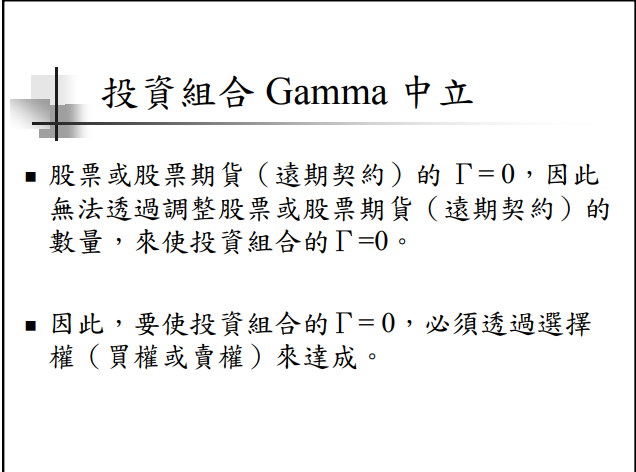
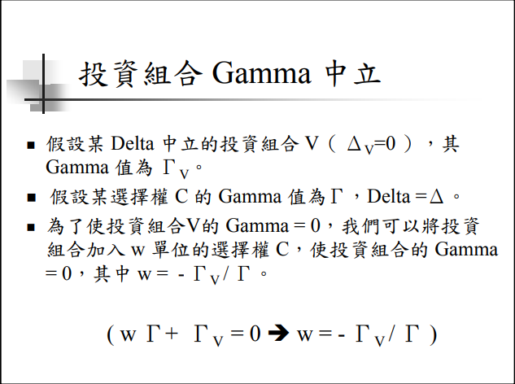
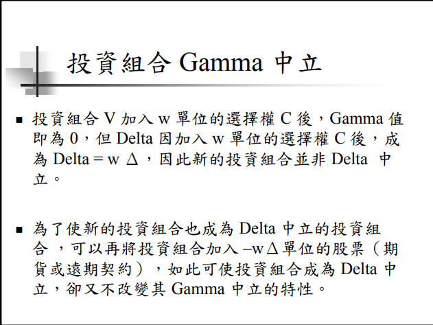
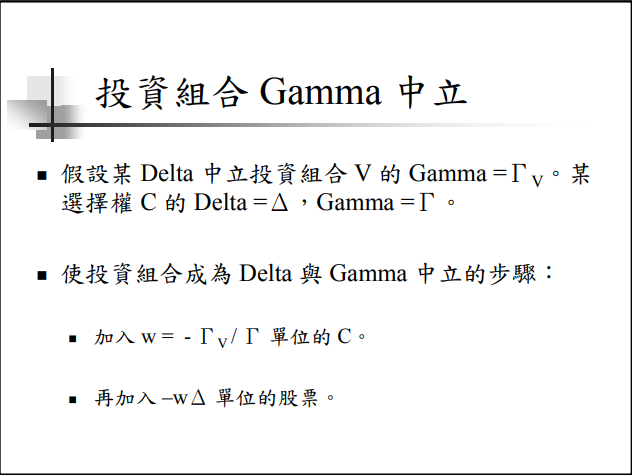
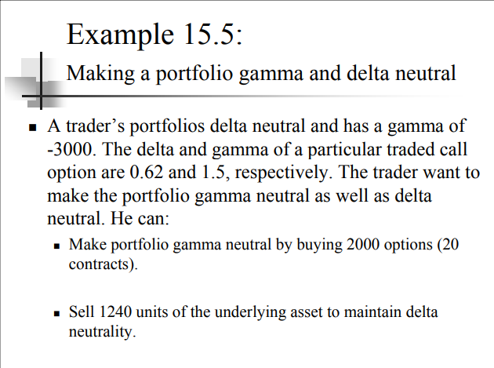
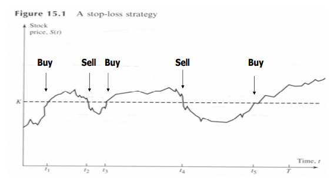

<!-- 避險策略 

> Hedge Strategy -->

金融機構出售100,000單位的歐式買權 , 獲得權利金 300,000 , 此時該金融機構如何進行避險 ? 

S = 49 , K = 50 , r = 5% , Vol = 20% , T=0.3846 , The expected return from the stock = 13%

根據計算權利金為 240,000

**依BS評價公式推導的過程可知， $240,000 即是在 BS 經濟環境下，金融機構的平均避險成本**

# Naked Position

該金融機構不采取任何避險策略則 , 

$S(T)<50$

該金融機構賺權利金 300,000

$S(T)>50$

ex $S(T)=60$ 則金融機構到期損失 

10 * 100,000 = 1000,000(1m) 扣除權利金 - 300,000(0.3m) 則損失 700,000(0.7m)

# Covered Position

> 保護買權避險策略

該金融機構采取保護買權避險策略則 , 買進 100,000 單位標的股票進行避險 :

$S(T)>50$

則賺權利金 0.3m 和股票收益 0.1m

$S(T)<50$

則避險部位損失 0.9m 扣除賺的權利金共虧損 0.6m

# delta 避險策略

delta 變動一單位對於 期權的權利金的變動單位 , 期權的改變是依據 Black Scholes 定價模型計算

已知 delta 為 : 

$$\Delta = \frac{\partial C}{\partial S} = N(d1)$$

如果考慮股利或者外國無風險利率則 : 

$$\Delta = \frac{\partial C}{\partial S} = e^{-r_fT}N(d1)$$

假設某金融機構出售 20口的買權（1口可買100 股）。

當時的股價 S(0) = $100，C(0)=$10，Δ=0.6 。

此該金融機構須購買 0.6 × 2000 =1200 股的標的股票，以進行 Delta 避險。

- S 上升 1 單位
    - 股票部位收入：$1200
    - 買權部位損失：$1200
    - 兩者抵銷

- S 下降 1 單位
    - 股票部位損失：$1200
    - 買權部位收入：$1200
    - 兩者抵銷

<!-- 在完全市場的情形下，透過Black-Sholes 公式，我們可以完美複製出一個選擇權。

因此，所謂的Delta避險策略，就是利用選擇權價格可以被完美複製的性質，持有Delta單位的標的資產，與投入無風險性資產，組成一個與該選擇權有一樣價格變化的投資組合，因此買賣選擇權所產生的風險，可以被此投資組合給抵消。

而選擇權價格，是會隨著時間股價的不同而改變，我們所持有的Delta部位亦會隨著時間改變，因此Delta避險策略亦屬於動態避險。

Delta 避險策略若在完全市場下，符合可連續調整以及無交易成本等的假設，是不會有任何的避險誤差產生，但實際上，我們只能離散的調整持有的Delta部位，而且也存在著交易成本，因此會存在著避險誤差，且此避險誤差可能為正或為負。 -->

# delta-gamma 避險策略

# stop-loss 避險策略

假設某金融機構出售一單位買權 , 在期權有效期間内 , $S>K$ 買一單位 $S$ , $S<K$ 則賣出 S

$S>K$ : covered position

$S<K$ : naked position

