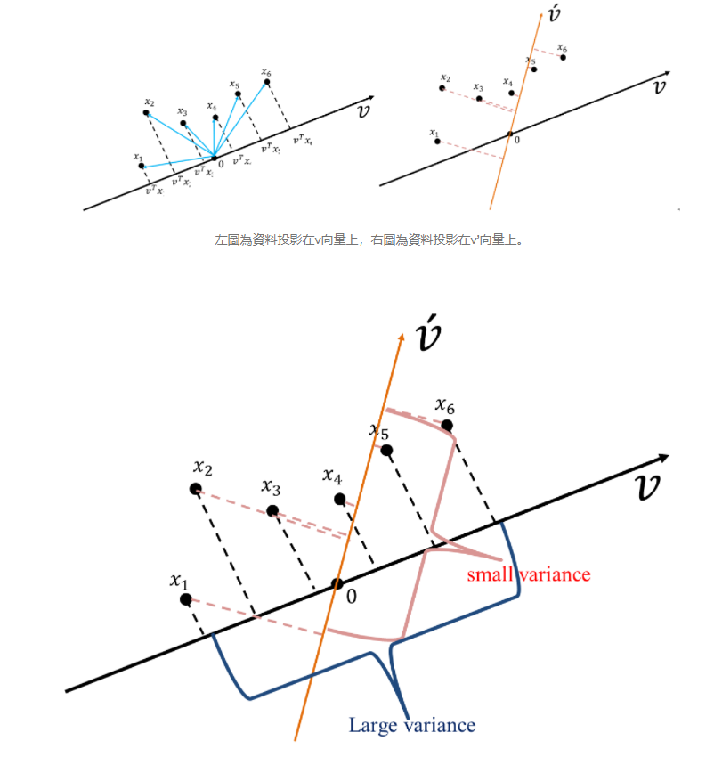

# 簡單介紹

- 是一種統計分析、簡化數據集的方法。它利用正交轉換來對一系列可能相關的變數的觀測值進行線性轉換，從而投影為一系列線性不相關變數的值，這些不相關變數稱為主成分（Principal Components）。

- 主成份分析的基本假設是希望資料可以在特徵空間找到一個投影軸(向量)投影後可以得到這組資料的最大變異量

- 經由線性組合而得的主成份，能保有原來變數最多的資訊

- 保有原來變數的資訊 ，主成份間不能重疊 ，以少數主成份代替原來多個變數

- 公式計算參考[1]

- 看纍計貢獻比率,決定主成分數量

- 全面瞭解PCA可以看[2] , [3]

# References

[1] https://chih-sheng-huang821.medium.com/%E6%A9%9F%E5%99%A8-%E7%B5%B1%E8%A8%88%E5%AD%B8%E7%BF%92-%E4%B8%BB%E6%88%90%E5%88%86%E5%88%86%E6%9E%90-principle-component-analysis-pca-58229cd26e71

[2] https://leemeng.tw/essence-of-principal-component-analysis.html

[3] http://120.118.226.200/member/hunght/%E6%B4%AA%E5%83%96%E9%BB%9B%E8%80%81%E5%B8%AB%E6%95%99%E6%9D%90(IEM)/Principal%20Component%20Analysis.pdf