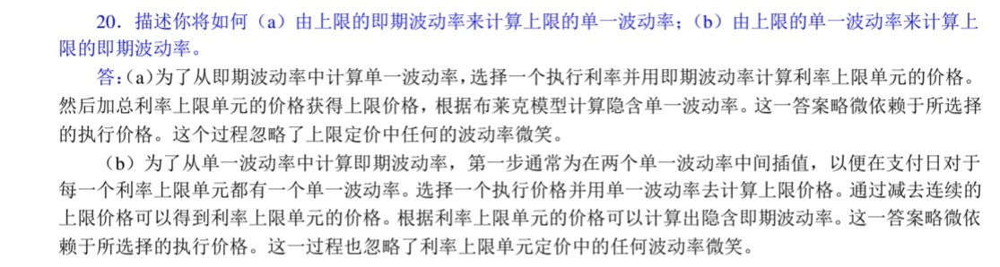

兩者利率都是針對 cap 和 Floor 

flat volatility 和 spot volatility 可以互相轉換 , 參考 29.20 例子的答案 (圖一)

采用不同波動率--> 即期波動率

采用相同的波動率隨著上下限的有效期限變動 --> 單一波動率

市場通常報出單一波動率 , 交易員通常估計即期波動率 ，來衡量利率衍生品有沒有溢價的可能性

下圖是轉換的手續

圖一

市場上有cap 和 floot 商品的隱含波動率報價